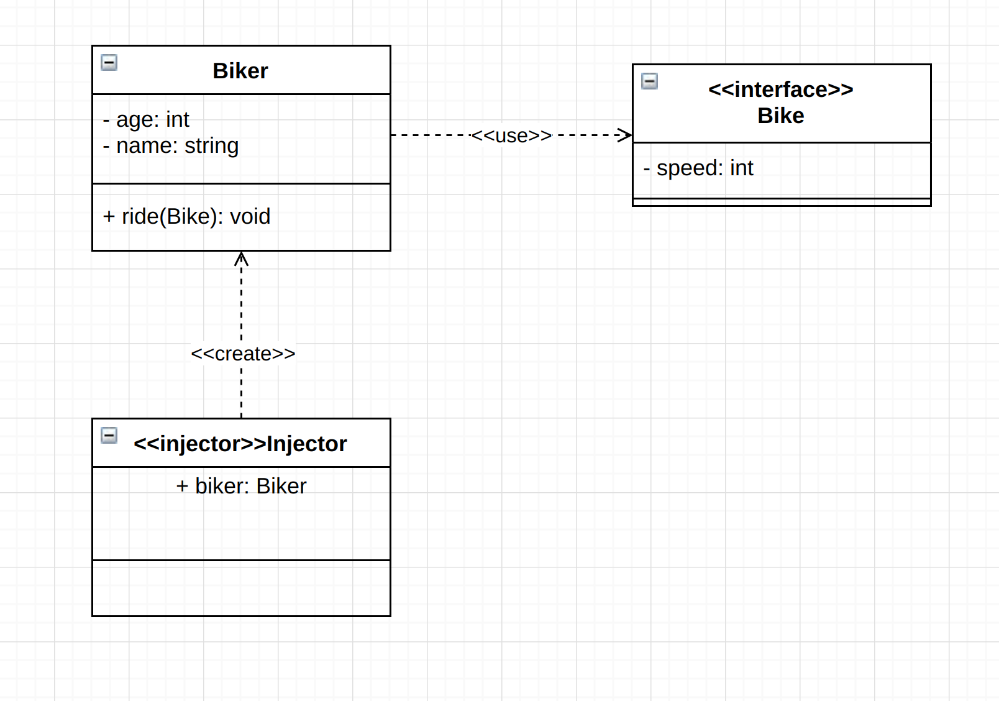
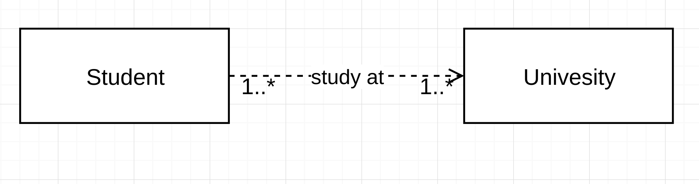
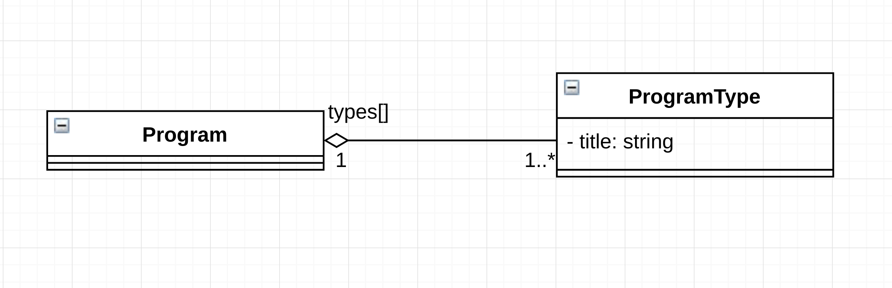
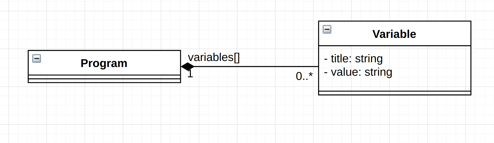
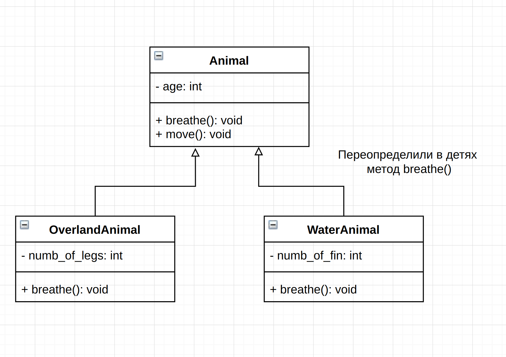
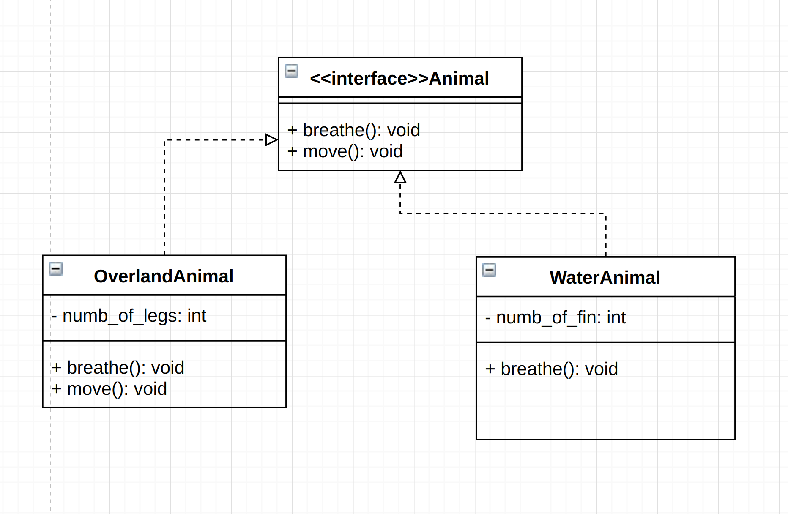
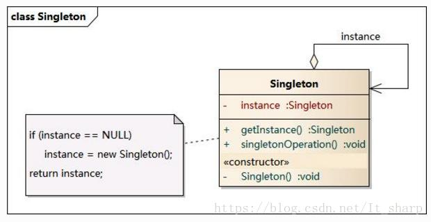

# UML
**Унифицированный язык моделирования - язык графического описания для объектного моделирования в области разработки программного обеспечения, для моделирования бизнес-процессов, системного проектирования и отображения организационных структур.**
+ [USE-cases](#usecases)
+ [Диаграмма активности](#activity)
+ [Диаграмма классов](#class)

###  USE-cases

###  Диаграмма активности

###  Диаграмма классов
**Структурная диаграмма языка моделирования UML, демонстрирующая общую структуру иерархии классов системы, их коопераций, атрибутов (полей), методов, интерфейсов и взаимосвязей между ними.**
+ Для описания диаграммы классов используются 3 сущности UML:
    + Структурные сущности (это классы)
    + Поведенческие сущости (это отношения между классами)
    + Аннотационные сущности (это комметарии)

+ **Структурные сущости**:
    + Класс предстваляется в виде блока, состоящего из 3х частей:
        + Имя класса
        + Атрибуты класса
        + Методы класса
    + Имя класса:
        + Простой класс подписываетс обычным шрифтом
        + Абстрактный класс подписывается курсивом
        + Если класс является интерфейсом, то перед его названием пишут `<<interface>>`
        + Кроме того классы могут быть служебными сущностями:
            + Main - сущность, с которой начинается программа, обозначается `<<main>>name`
            + Injector - создает классы программы, обозначается `<<injector>>name`
            + UI - класс служит для отображения интерфейса, обозначается `<<UI>>`
    + Атрибуты класса:
        + Являются свойствами класса
        + Указывается их тип и название атрибута
        + Статические атрибуты обозначаются подчеркиванием
    + Методы класса:
        + Геттеры и сеттеры не пишутся
        + Абстрактные методы обозначаются курсивом
        + Статические методы обозначаются подчеркиванием
        + Указывается тип принимаемых аргументов
        + Указывается возращаемый тип
    + Модификаторы доступа:
        + `+` - public
        + `#` - protected
        + `-` - private
    

+ **Поведенческие сущности**:
    + 4 вида поведенческих сущностей:
        + Зависимость
        + Ассоциация
        + Обобщение
        + Реализация
    + **Зависимость** - одна сущность зависит от другой, т.е. изменения в одной сущности приводит к изменениям в зависимой сущности. Может указываться направление, а так же вид зависимости:
    

    + **Ассоциация** показывает, что объекты одной сущности связаны с объектами другой сущности таким образом, что можно перемещаться от объектов одного класса к другому. В общем случае ассоциация может выражать любое отношение между сущностями. Можно указывать количество экземпляров в данной связи:
        

    + Ассоциация разделяется на 4 вида:
        + Агрегация
        + Композиция
    + **Агрегация** - вид ассоциации, представляющий структурную связь целого с его частями. Агрегация не создает и не уничтожает элементы, содержащиеся в контейнере. Можно указать количество зависимых частных сущностей от целых. Если используется агрегация, то не нужно указывать сущности "часть" в сущности "целое" как атрибут: его название, которое использует "целое", указывается *над связью*. Графически агрегация представляется пустым ромбом на блоке класса «целое», и линией, идущей от этого ромба к классу «часть»:
        

    + **Композиция** - это форма агрегации с четко выраженными отношениями владения и совпадением времени жизни частей и целого. Контейнер создает содержимое. Если контейнер будет уничтожен, то всё его содержимое будет также уничтожено. Графически представляется как и агрегация, но с закрашенным ромбиком:
        

    + **Обобщение** - отражает наследование. Графически обобщение представлено в виде сплошной линии с пустой стрелкой, указывающей на родителя:
        

    + **Реализация** - связь между интерфейсами и классами, которые реализуют эти интерфейсы. В графическом исполнении связь реализации – это гибрид связей обобщения и зависимости: треугольник указывает на поставщика, а второй конец пунктирной линии – на клиента:
        
+ **Аннотационные сущности** - просто комментарии к остальным сущностям:
    
    