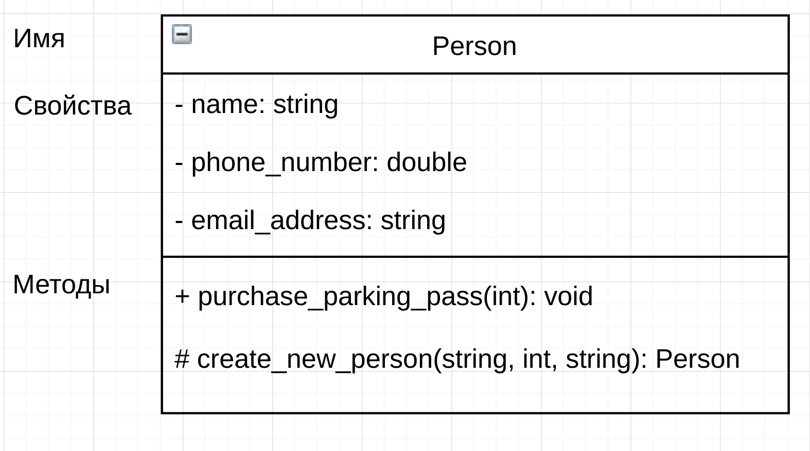

# UML
**Унифицированный язык моделирования - язык графического описания для объектного моделирования в области разработки программного обеспечения, для моделирования бизнес-процессов, системного проектирования и отображения организационных структур.**
+ [USE-cases](#usecases)
+ [Диаграмма активности](#activity)
+ [Диаграмма классов](#class)

###  USE-cases

###  Диаграмма активности

###  Диаграмма классов
**Структурная диаграмма языка моделирования UML, демонстрирующая общую структуру иерархии классов системы, их коопераций, атрибутов (полей), методов, интерфейсов и взаимосвязей между ними.**
+ Для описания диаграммы классов используются 3 сущности UML:
    + Структурные сущности (это классы)
    + Поведенческие сущости (это отношения между классами)
    + Аннотационные сущности (это комметарии)

+ **Структурные сущости**
    + Класс предстваляется в виде блока, состоящего из 3х частей:
        + Имя класса
        + Атрибуты класса
        + Методы класса
    + Имя класса:
        + Простой класс подписываетс обычным шрифтом
        + Абстрактный класс подписывается курсивом
        + Если класс является интерфейсом, то перед его названием пишут `<<interface>>`
    + Атрибуты класса:
        + Являются свойствами класса
        + Указывается их тип и название атрибута
        + Статические атрибуты обозначаются подчеркиванием
    + Методы класса:
        + Геттеры и сеттеры не пишутся
        + Абстрактные методы обозначаются курсивом
        + Статические методы обозначаются подчеркиванием
    + Модификаторы доступа:
        + `+` - public
        + `#` - protected
        + `-` - private
        
       