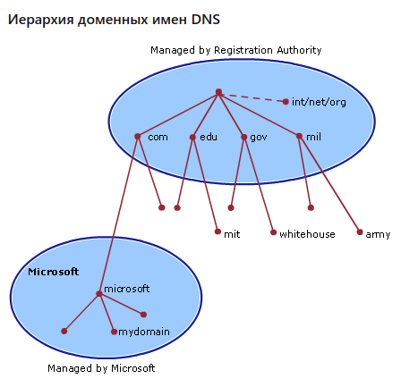

# Networks

+ [Sockets](#sockets)
+ [DNS](#dns)

### <a name="sockets"> Sockets </a>
+ Сокеты используются для пересылки сообщений по сети. Сокеты можно охарактеризовать следующими методами:
  + socket() - открывает соединение;
  + bind() - привязывает сервер к конкретному адресу а хосту;
  + listen() - сервер прослушивает соединения с клиентами;
  + accept() - принимает или завершает соединение;
  + connect() - сервер устанавливает соединение с сервером и делает трестороннее рукопожатие. Этот шаг обеспечивает доступность соединения для каждой стороны. Другими словами, что сервер может связаться с клиентом и наоброт;
  + send() - отправка сообщения;
  + recv() - принять сообщение;
  + close() - закрыть сокет;
+ Схему взаимодействия по сокету можно представить следующией  картинкой:
    

###  DNS
+ DNS(Domain name system) - иерархическая децентрализованная система имен для различных ресурсов. На нее приходит запрос с понятным человеку названием а возвращается ответ в виде IPv4/6 адреса сервера.
+ Архитектура DNS - это иерархическая распределенная база данных и связанный с ней набор протоколов, которые определяют:
    + Механизм запроса и обновления базы данных.
    + Механизм репликации информации в базе данных между серверами.
    + Схему базы данных.
+ Система доменных имен реализована как иерархическая и распределенная база данных, содержащая различные типы данных, включая имена хостов и доменные имена. Имена в базе данных DNS образуют иерархическую древовидную структуру, называемую **пространством имен домена**. Полное доменное имя (fully qualified domain name(FQDN)) однозначно определяет позицию хоста в иерархическом дереве DNS путем указания списка имен, разделенных точками на пути от хоста, на который имеется ссылка, к корню. DNS-серверы часто функционируют как DNS-клиенты, запрашивая другие серверы, чтобы полностью разрешить запрошенное имя. 
+ Для обозначеия иерархии используются точки. От этих обозначений зависит уровень домена в иерархической системе. Например `microsoft.com` - это доменное имя второго уровня, `mydomain.microsoft.com` - это поддомен:
    