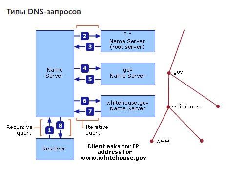

# Networks

+ [Sockets](#sockets)
+ [DNS](#dns)

### <a name="sockets"> Sockets </a>
+ Сокеты используются для пересылки сообщений по сети. Сокеты можно охарактеризовать следующими методами:
  + socket() - открывает соединение;
  + bind() - привязывает сервер к конкретному адресу а хосту;
  + listen() - сервер прослушивает соединения с клиентами;
  + accept() - принимает или завершает соединение;
  + connect() - сервер устанавливает соединение с сервером и делает трестороннее рукопожатие. Этот шаг обеспечивает доступность соединения для каждой стороны. Другими словами, что сервер может связаться с клиентом и наоброт;
  + send() - отправка сообщения;
  + recv() - принять сообщение;
  + close() - закрыть сокет;
+ Схему взаимодействия по сокету можно представить следующией  картинкой:
    

### <a name="dns">  DNS </a> 
+ DNS(Domain name system) - иерархическая децентрализованная система имен для различных ресурсов. На нее приходит запрос с понятным человеку названием а возвращается ответ в виде IPv4/6 адреса сервера.
+ Архитектура DNS - это иерархическая распределенная база данных и связанный с ней набор протоколов, которые определяют:
    + Механизм запроса и обновления базы данных.
    + Механизм репликации информации в базе данных между серверами.
    + Схему базы данных.
+ Система доменных имен реализована как иерархическая и распределенная база данных, содержащая различные типы данных, включая имена хостов и доменные имена. Имена в базе данных DNS образуют иерархическую древовидную структуру, называемую **пространством имен домена**. Полное доменное имя (fully qualified domain name(FQDN)) однозначно определяет позицию хоста в иерархическом дереве DNS путем указания списка имен, разделенных точками на пути от хоста, на который имеется ссылка, к корню. DNS-серверы часто функционируют как DNS-клиенты, запрашивая другие серверы, чтобы полностью разрешить запрошенное имя. 
+ Для обозначеия иерархии используются точки. От этих обозначений зависит уровень домена в иерархической системе. Например `microsoft.com` - это доменное имя второго уровня, `mydomain.microsoft.com` - это поддомен:
    
+ Типы доменных имен:

Тип имени       | Описание | Пример
------------- | ------------- | ------------- 
Корневой домен | Это вершина дерева, представляющая безымянный уровень; иногда он отображается как две пустые кавычки («»), указывающие на нулевое значение. При использовании в доменном имени DNS оно обозначается точкой в конце (.), Обозначающей, что имя находится на корневом или наивысшем уровне доменной иерархии. В этом случае доменное имя DNS считается полным и указывает на точное место в дереве имен. Указанные таким образом имена являются полными доменными именами. | Одна точка (.) Или точка в конце имени, например «example.microsoft.com.».
Домен верхнего уровня | Имя, используемое для обозначения страны / региона или типа организации, использующей имя. | «.com» означает имя, зарегистрированное для бизнеса для коммерческого использования в Интернете.
Домен второго уровня | Имена переменной длины, зарегистрированные на физическое лицо или организацию для использования в Интернете. Эти имена всегда основаны на соответствующем домене верхнего уровня, в зависимости от типа организации или географического местоположения, в котором используется имя. | «microsoft.com.» - является доменным именем второго уровня, зарегистрированным в Microsoft регистратором доменных имен DNS в Интернете.
Поддомен | Дополнительные имена, которые организация может создать на основе зарегистрированного доменного имени второго уровня. К ним относятся имена, добавленные для роста дерева имен DNS в организации и разделения его на отделы или географические местоположения. | "example.microsoft.com.”, Который представляет собой вымышленный поддомен, назначенный Microsoft для использования в именах примеров документации.
Имя хоста или ресурса | Имена, которые представляют собой лист в дереве имен DNS и идентифицируют конкретный ресурс. Обычно крайняя левая метка доменного имени DNS идентифицирует конкретный компьютер в сети. Например, если имя на этом уровне используется в записи ресурса хоста (A), оно используется для поиска IP-адреса компьютера на основе его имени хоста. | «host-a.example.microsoft.com.», где первая метка («host-a») - это имя хоста DNS для определенного компьютера в сети.
+ База данных DNS состоит из записей ресурсов (resource record (RR)). Каждая запись RR идентифицирует определенный ресурс в базе данных. В DNS существуют различные типы RR:

Описание      | Время жизни TTL | Тип | Данные
------------- | ------------- | ------------- | ------------- 
Начало полномочий | По умолчанию TTL составляет 60 минут. | SOA | Имя владельца DNS-имя первичного сервера имен, серийный номер, интервал обновления,иИнтервал повтора, время хранения, минимальный TTL
Хост | TTL для конкретной записи, если присутствует, или TTL для зоны (SOA) | A | Имя владельца (DNS-имя хоста), IP-адрес хоста
Сервер имен | TTL для конкретной записи, если присутствует, или TTL для зоны (SOA) | NS |Имя владельца, DNS-имя сервера имен 
Почтовый обменник | TTL для конкретной записи, если присутствует, или TTL для зоны (SOA) | MX | Имя владельца, DNS-имя почтового сервера, предпочтительный номер
Каноническое имя | TTL для конкретной записи, если присутствует, или TTL для зоны (SOA) | CNAME | Имя владельца (псевдоним), DNS-имя хоста
+ DNS-запросы могут быть отправлены от DNS-клиента (преобразователя) на DNS-сервер или между двумя DNS-серверами. Запрос DNS - это просто запрос записей ресурсов DNS указанного типа записи ресурсов с указанным именем DNS. Например, запрос DNS может запрашивать все записи ресурсов типа A (хост) с указанным именем DNS.
+ Есть два типа DNS-запросов, которые могут быть отправлены на DNS-сервер:
    + Рекурсивный
    + Итеративный

    
    1. Рекурсивный запрос для www.whitehouse.gov (запись ресурса)
    2. Итеративный запрос для www.whitehouse.gov (запись ресурса)
    3. Ссылка на сервер имен .gov (записи ресурсов NS, для .gov); для простоты опущены итеративные A-запросы DNS-сервера (слева) для разрешения IP-адресов имен хостов серверов имен, возвращаемых другими DNS-серверами.
    4. Итеративный запрос для www.whitehouse.gov (запись ресурса)
    5. Направление на сервер имен whitehouse.gov (запись ресурса NS, для whitehouse.gov)
    6. Итеративный запрос для www.whitehouse.gov (запись ресурса)
    7. Ответ на итеративный запрос с сервера whitehouse.gov (IP-адрес www.whitehouse.gov)
    8. Ответ на исходный рекурсивный запрос от локального DNS-сервера к преобразователю (IP-адрес www.whitehouse.gov)

+ Время жизни записей (time to live(TTL)). Значение времени жизни (TTL) в записи ресурса указывает продолжительность времени, используемого другими DNS-серверами, чтобы определить, сколько времени нужно кэшировать информацию для записи до истечения срока ее действия и ее удаления. Например, большинство записей ресурсов, создаваемых службой DNS-сервера, наследуют минимальный (по умолчанию) TTL, равный одному часу с начала записи ресурса (SOA), что предотвращает расширенное кэширование другими DNS-серверами.
Преобразователь DNS-клиента кэширует ответы, которые он получает при разрешении DNS-запросов. Эти кешированные ответы можно затем использовать для ответа на последующие запросы той же информации. Однако кэшированные данные имеют ограниченное время жизни, указанное в параметре TTL, возвращаемом с данными ответа. TTL гарантирует, что DNS-сервер не хранит информацию так долго, что она устареет.

+ **DNS-сообщение** представляет из себя 12-байтовый заголовок фиксированной длины и переменное тело, в котором передается запросы и ответы с сервера.
    + Запрос DNS:
        + Заголовок DNS
        + Записи вопросов - вопросы для сервера имен
        + Записи ресурсов - разделы ответа, полномочий и дополнительной информации в ответном сообщении DNS
        + Записи авторитетных серверов
        + Дополнительные записи - записи с дополнительной информацией
    + **Заголовок** запроса состоит из 12 байт и содержит следующие поля:
        + ID транзакции(16 бит) - Определяет конкретную транзакцию DNS. Идентификатор транзакции создается отправителем сообщения и копируется ответчиком в свое ответное сообщение. Используя идентификатор транзакции, DNS-клиент может сопоставлять ответы на свои запросы.
        + Флаги (16 бит): Ответ на запрос, Код операции(1 бит), Авторитетный ответ(4 бита), Усечение(1 бит), Требуется рекурсия(1 бит), Доступна рекурсия(1 бит), Зарезервированный(3 бита), Код возврата(4 бита).
        + Количество записей ресурса запроса (16 бит) - количество записей вопросов сообщения DNS.
        + Количество записей ресурса ответа (16 бит) - количество записей ответа DNS-сообщения.
        + Количество записей авторитетного сервера(16 бит) - оличество записей авторитетного сервера в сообщении DNS. 
        + Количество записей дополнительных ресурсов - количество дополнительных записей ресурсов в сообщении DNS.
    + **Записи запросов** состоит из имени вопроса и типа вопроса:
        + Имя вопроса - запрашиваемое доменное имя
        + Тип вопроса - 16-разрядное целое число, используемое для представления типа записи ресурса, самые популярные из них:
            + 0x01 - Запись хоста (A)
            + 0x02 - Запись сервера имен (NS)
            + 0x05 - Запись псевдонима (CNAME)
        + Класс вопроса - Представляет класс вопросов IN (Интернет) и обычно имеет значение 0x0001.
    
    + **Записи ресурсов** состоит из следующих частей:
        + Имя записи ресурса - Доменное имя DNS записано как поле переменной длины с тем же форматированием, что и поле «Имя вопроса».
        + Тип записи ресурса - Значение типа записи ресурса.
        + Класс записи ресурса - Код класса записи ресурса, Интернет-класс, 0x0001.
        + Время жить - TTL выражается в секундах как 32-битное беззнаковое поле.
        + Длина данных ресурса - 2-байтовое поле, указывающее длину данных ресурса.
        + Данные о ресурсах - Данные переменной длины, соответствующие типу записи ресурса.