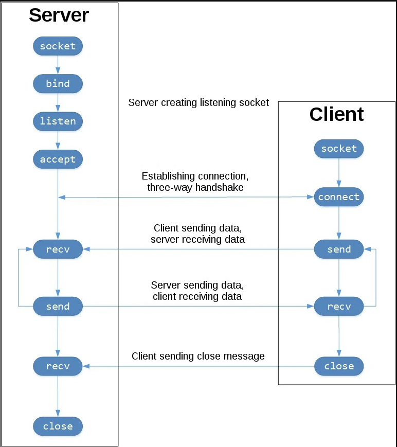

# Networks

+ [Sockets](#sockets)

### <a name="sockets"> Sockets </a>

+ Сокеты используются для пересылки сообщений по сети. Сокеты можно охарактеризовать следующими методами:
  + socket() - открывает соединение;
  + bind() - привязывает сервер к конкретному адресу а хосту;
  + listen() - сервер прослушивает соединения с клиентами;
  + accept() - принимает или завершает соединение;
  + connect() - сервер устанавливает соединение с сервером и делает трестороннее рукопожатие. Этот шаг обеспечивает доступность соединения для каждой стороны. Другими словами, что сервер может связаться с клиентом и наоброт;
  + send() - отправка сообщения;
  + recv() - принять сообщение;
  + close() - закрыть сокет;
+ Схему взаимодействия по сокету можно представить следующией  картинкой:
    