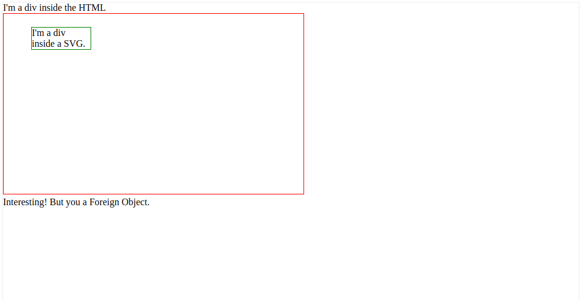
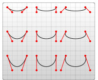
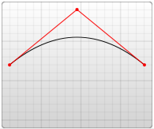

# HTML
(HyperText Markup Language)
строит структуру web-страницы.
+ [HTML-элементы](#elements)
+ [Типы элементов](#type_of_elements)
+ [HTML-атрибуты](#attrs)
+ [SVG](#svg)
 

## <a name="elements"></a>HTML-элементы
HTML-элементы - это строительные блоки любого HTML-докуманта.
HTML-элемент состоит из **<открывающего>** и **</закрывающего>** тегов, которые
обрамляют его **содержимое**.
HTML-докумаент может состоять из вложенных друг в друга элементов. В приведенном ниже примере 
элемент `<body>` включает в себя теги `<p>`, тег `<br />` и содержимое "Параграф текста":
```html
<html>
    <head>
        <title>Первая страница</title>
    </head>
    <body>
        <P>Параграф текста</P>
    </body>
</html>
```
Некоторые элементы очень короткие. Так как нельзя поместить содержимое внутрь тега
переноса строки `<br />` и так как нет открывающего и закрывающего тега переноса строки,
то его можно считать единым тегом:
```html
...
<p>Параграф текста</p>
<p>Здесь <br /> перенос строки</p>
...
```

## <a name="type_of_elements"></a>Типы элементов
В HTML большинство элементов - это так называемые **блочные** или **строчные** элементы
+ Блочные элементы начинаются с новой строки: `<h1>,<form>,<li>,<ol>,<ul>` и т.д.
+ Строчные элементы обычно пишутся без переноса строки: `<b>,<a>,<strong>,,<input>` и т.д.

+ Элемент `<div>` - **блочный** элемент, часто используемый как **контейнер** для других элементов HTML.
При использовании CSS, элемент `<div>` может задавать стиль блокам контента:
```html
<html>
    <body>
        <h1>Зоголовок</h1>
        <div 
            style="backgroung-color:green;
            color:white;
            padding:20px;">
            <p>Это параграф вашего контента.</p>
            <p>Это еще один ээлемент контента</p>
        </div>
    <body>
</html>
```
+ Элемент `<span> `- **строчный** элемент, часто используемый как контейнер для текста.
При импользовании CSS элемент `<span>` может задавать стиль отдельных частей текста:
```html
    <body>
        <h2> Некоторое
            <span
            style="color:red">важное </span>
            сообщение</h2>
        </h2>
    </body>
```
+ Можно вставлять строчные элементы внутри блочных элементов, но блочные внутри строчных - нельзя.


## <a name="attrs"></a> HTML-атрибуты
Атрибуты содержат дополнительную информацию ою элементе или теге, а также изменяют их.
Большинство атрибутов имеют значения; значения изменяют атрибут.
```html
<p align="center">
    Этот текст выровнян по центру
</p>
```
В данном примере значение атрибута align "center" означает, 
что содержимое элемента p должно быть выровняно по центру.

## <a name="svg"></a> SVG
SVG - это формат изображений, удобный для передачи векторной графики. Очень популярен в интернете, так как каждый элемент в теге `<svg>` является объектом, в отличае от элемента `<canvas>`,где, если что-то добавлено в него, то оно становится частью него, к которой доступ получить невозможно. Однако `<canvas>` лучше подходит для форматов растровой графики. Вот некоторые эдлементы, которые можно создавать при помощи **`<svg>`**:
+ **Круг**:
    ```html
    <!DOCTYPE html>
    <html>
    <body>

    <svg width="100" height="100">
      <circle cx="50" cy="50" r="40" stroke="green" stroke-width="4" fill="yellow" />
    </svg>

    </body>
    </html>
    ```
+ **Прямоугольник**:
    ```html
    <svg width="400" height="100">
      <rect width="400" height="100" style="fill:rgb(0,0,255);stroke-width:10;stroke:rgb(0,0,0)" />
    </svg>
    ```
+ **Прямоугольник со скошенными углами**:
    ```html
    <svg width="400" height="180">
      <rect x="50" y="20" rx="20" ry="20" width="150" height="150"
      style="fill:red;stroke:black;stroke-width:5;opacity:0.5" />
    </svg>
    ```
+ **Многоугольники**:
    ```html
    <svg width="300" height="200">
      <polygon points="100,10 40,198 190,78 10,78 160,198"
      style="fill:lime;stroke:purple;stroke-width:5;fill-rule:evenodd;" />
    </svg>
    ``` 
+ **Вставление стороннего HTML-элемента в SVG**:
    ```html
        <!DOCTYPE html>
        <html>
        <head>
            <meta charset="UTF-8">
            <title>HTML inside SVG</title>
            <style type="text/css"></style></head>
            <body>
                <div>I'm a div inside the HTML</div>
                <svg width="500" height="300" style="border:1px red solid">
                    <foreignobject class="node" x="46" y="22" width="100" height="100">

                            <div style="border:1px green solid">I'm a div inside a SVG.</div>                  
                    </foreignobject>
                </svg>
                <div>Interesting! But you a Foreign Object.</div>
            </body>
        </html>
    ```
    

+ **Пути** - с их помощью можно рисовать сложные фигуры:
Элемент **<path>** ("путь")– наиболее мощный элемент в библиотеке основных форм SVG. С его помощью можно создавать отрезки, кривые, дуги и многое другое. У него есть единственный атрибут: **d**, который содержит серию комманд и параметров, используемых итими командами.
Каждая команда обозначается специальной буквой:
  + **Команды прямых линий**:
    + **M** - передвинуть курсор к этой токе, это значит, из нее начнется рисование новой фигуры
    + **L** - сделать тинию к отмеченной точке:
        ```HTML 
        <path d="M 10 10 L 50 10" stroke="black" fill="transparent"/>
        ```
    + **V** - рисование только вертикальной линии в указанную точку, требует только один аргумент, так как смотрит только по вертикали
    + **H** - рисование только горизонтальной линии в указанную точку.
    + **Z** - замыкание фигуры. Не требует аргуметов, так так автоматически просто проводит линию к первой точке. 
        ```html
          <!-- Отрисовка черного квадрата -->
         <path d="M10 10 H 90 V 90 H 10 Z" fill="transparent" stroke="black"/>
        ```
  + **Команды кривых линий**:
    + **C x1 y1, x2 y2, x y** - кубическая кривая Безье. Она принимает 2 контрольные точки для каждой линии. Эти точки регулируют ее кривизну. Последняя точка - это конечная точка линии:
        ```html
        <svg width="190" height="160">
          <path d="M10 10 C 20 20, 40 20, 50 10" stroke="black" fill="transparent"/>
          <path d="M70 10 C 70 20, 120 20, 120 10" stroke="black" fill="transparent"/>
          <path d="M130 10 C 120 20, 180 20, 170 10" stroke="black" fill="transparent"/>
          <path d="M10 60 C 20 80, 40 80, 50 60" stroke="black" fill="transparent"/>
          <path d="M70 60 C 70 80, 110 80, 110 60" stroke="black" fill="transparent"/>
          <path d="M130 60 C 120 80, 180 80, 170 60" stroke="black" fill="transparent"/>
          <path d="M10 110 C 20 140, 40 140, 50 110" stroke="black" fill="transparent"/>
          <path d="M70 110 C 70 140, 110 140, 110 110" stroke="black" fill="transparent"/>
          <path d="M130 110 C 120 140, 180 140, 170 110" stroke="black" fill="transparent"/>
        </svg>
        ```
        
    + **Q x1 y1, x y** - квадратичная кривая Безье, задается только одной точкой:
        ```html
        <svg width="190" height="160" xmlns="http://www.w3.org/2000/svg">
          <path d="M10 80 Q 95 10 180 80" stroke="black" fill="transparent"/>
        </svg>
        ```
        

  *Вызов команды с **заглавной буквы** обозначает абсолютные координаты на странице, а команда со **строчной** буквой - относительные*. Координаты в атрибуте d всегда пишутся без указания единиц измерения и находятся в системе пользовательских координат (обычно это пиксели).

