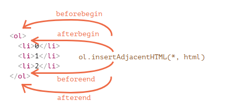

# Javascript
позволяет наладить то, как будет работать клиент
+ [Ввод и вывод](#consolelog)
+ [Переменные](#variables)
+ [Условия и операторы](#conditions)
+ [Функции](#function)
+ [Структуры данных](#structs)
+ [ООП](#oop)
+ [Встроенные в JS объекты](#global)
+ [Функции высшего порядка](#highlevelfoo)
+ [JSON](#json)
+ [DOM](#dom)
+ [События](#events)
+ [Анимация](#anime)
+ [Запросы](#request)

#### <a name="consolelog"></a>Вывод
+ В консоль:
    ```javascript
    console.log("Hello world");
    ```
+ Во всплывающее окно:
    ```javascript
    alert("Goog morning");
    ```
+ Окно с вопросом и кнопками OK/Cancel:
    ```javascript
    confirm("Delete this file?");
    ```
+ Окно, к отором можно ввести ответ. Первый аргумент - это то, что будет написанно в вопросе, второй - это то, что будет введено по умолчанию в текстбокс:
    ```javascript
    prompt("Расскажи мне всё, что знаешь.", "...");
    ```

#### <a name="variables"></a> Переменные
В JS используется динамическая типизация, потому для объявление переменной любого типа используется:
+ **var** - это глобальные переменные, они видны на протяжении всей программы и области видимости у них как таковой нет:
    ```javascript
    var numb = 5 * 5;
    ```
+ **let** - у объявлений переменной через let есть несколько основных отличий от var:
  + Область видимости переменной let – блок {...}:
    ```javascript
    var apples = 5;
    let apples1 = 5;
    if (true) {
        var apples = 10;
        let apples1 = 10;
        alert(apples); // 10 (внутри блока)
        alert(apples1);// 10 (внутри блока)
    }
    alert(apples); // 10 (снаружи блока то же самое)
    alert(apples1); // 5!!!
    ```
  + Переменная let видна только после объявления:
    ```javascript
    alert(a); // undefined
    alert(b); // Ошибка, нет такой переменной
    var a = 5;
    let b = 5;
    ```
    Так же мы не можешь объявить переменную let повторно:
    ```javascript
    let x;
    let x; //ошибка, переменная x уже объявленна
    ```
+ **const** - создает константу, которую нельзя менять:
    ```javascript
    const apple = 5;
    apple = 10; // ошибка
    ```
    В остальном `const` аналогично `let`.

#### <a name="conditions"></a> Условия
Основной способ направлять ход программы - это условные переходы:
```javascript
var theNumber = prompt("Выбери число ", "");
if (!isNaN(theNumber))
    alert("Твоё число – квадратный корень из " + theNumber * theNumber);
```
**Операторы сравнения:**
+ Равно(==) - оператор равно сначала приводит операнды к одному типу, и затем применяет строгое сравнение. Если оба операнда являются объектами, то JavaScript сравнивает внутренние ссылки, которые равны в том случае, если они ссылаются на один и тот же объект в памяти.
    ```javascript
    1  ==  1      // истина
    "1" ==  1      // истина
    1  == '1'     // истина
    3  ==  5      // ложь
    0  == false   // истина 
    "foo" == "bar" // ложь
    ```
+ Не равно (!=) - возвращает `true` только в том слуае, если опперанты не равны.
+ Строго равно(===) - Оператор возвращает истину в том случае, если операнды строго равны, Строгие сравнения истинны только в том случае, если типы сравниваемых значений являются одинаковыми (к примеру: string-string, number-number). В отличие от оператора равно, данный оператор не приводит операнды к одному типу:
    ```javascript
    3 === 3   // истина
    3 === '3' // ложь
    'foo' === 'foo' // истина
    ```
+ Строго неравно(!==):
    ```javascript
    3 !== '3' // истина
    4 !== 3   // истина
    ```
#### <a name="function"></a> Функции
Определение функции – обычное определение переменной, где значение, которое получает переменная, является функцией.
```javascript
var square = function(x) {
    return x * x;
};
```
Вызов функции:
```javascript
square(3);
```
Так же функцию можно объявлять так:
```javascript
function square(x){
    return x*x;
}
```
В данном случае не будет важно, где будет вызванная данная функция - до ее объявления или после, так как js автоматически отправт ее объявление вначало.
Все переменные объявленные внутри функции, локальны внутри нее.

#### <a name="structs"></a>Структуры данных
+ **Массивы**
    ```javascript
    var listOfNumbers = [2, 3, 5, 7, 11];
    console.log(listOfNumbers[1]);
    // → 3
    console.log(listOfNumbers[1 - 1]);
    // → 2
    ```
    Свойства:
     + ```arr.length;``` - длина массива
     + ```arr.push(x)``` - добавление элемента x в конец массива.
     + ```arr.pop()``` - удаление последнего элемнта массива
     + ```arr.join(" ")``` - преобразование к строке, где элементы разделены пробелами
     + ```arr.indexOf(x)``` - возвращает индекс x в этом массиве

+ Поиск номеры элемента в массиве:
  **`array.indexOf(element)`**:
  ```javascript
  fruits.push('Манго');
  // ["Клубника", "Банан", "Манго"]
  
  var pos = fruits.indexOf('Банан');
  // 1
  ```

+ Удаление элеентов в массиве:
  **`array.splice(begin, end)`**
  ```javascript
  var vegetables = ['Капуста', 'Репа', 'Редиска', 'Морковка'];
  console.log(vegetables); 
  // ["Капуста", "Репа", "Редиска", "Морковка"]

  var pos = 1, n = 2;

  var removedItems = vegetables.splice(pos, n); 
  // так можно удалить элементы, n определяет количество элементов для удаления,
  // начиная с позиции(pos) и далее в направлении конца массива.

  console.log(vegetables); 
  // ["Капуста", "Морковка"] (исходный массив изменён)

  console.log(removedItems); 
  // ["Репа", "Редиска"]
  ```
  
+ Перебор массива:
  **`forEach`** - Метод forEach() выполняет функцию callback один раз для каждого элемента, находящегося в массиве в порядке возрастания. Она не будет вызвана для удалённых или пропущенных элементов массива. Однако, она будет вызвана для элементов, которые присутствуют в массиве и имеют значение undefined. 
  Синтаксис:
  ```javascript
  arr.forEach(function callback(currentValue, index, array) {
      //your iterator
  }[, thisArg]);
  ```
    + `item` – очередной элемент массива.
    + `i` – его номер.
    + `arr` – массив, который перебирается
    ```javascript
    var arr = ["Яблоко", "Апельсин", "Груша"];

    arr.forEach(function(item, i, arr) {
      alert( i + ": " + item + " (массив:" + arr + ")" );
    });
    ```
    Или так:
    ```javascript
    const array1 = ['a', 'b', 'c'];

    array1.forEach(element => console.log(element));

    // expected output: "a"
    // expected output: "b"
    // expected output: "c"
    ```

+ **Объекты** - Переменные типа object (объект) – коллекции произвольных свойств, где можно добавлять и удалять свойства объекта по желанию. Один из способов
    создать объект – использовать фигурные скобки. Свойству можно назначать значение через оператор =. Если у него ранеебыло значение, оно будет заменено. Если свойство отсутствовало, оно будет создано:
    ```javascript
    var day1 = {
        squirrel: false,
        events: ["работа", "тронул дерево", "пицца", "пробежка", "телевизор"]
    };
    console.log(day1.squirrel);
    // → false
    console.log(day1.wolf);
    // → undefined
    day1.wolf = false;
    console.log(day1.wolf);
    // → false
    ```
    Чтобы удалить какое-либо свойство, необходимо использовать оператор **Delete**:
    ```javascript
    var anObject = {left: 1, right: 2};
    console.log(anObject.left);
    // → 1
    delete anObject.left;
    console.log(anObject.left);
    // → undefined
    console.log("left" in anObject);
    // → false
    console.log("right" in anObject);
    // → true
    ```
    Так как фунции в JS можно присвоить переменным, то их можно присвоить свойствам объектом, в таком случае данные функции будут являться методами объектов:
    ```javascript
    var rabbit = {};
    rabbit.speak = function(line) {
        console.log("Кролик говорит '" + line + "'");
    };
    rabbit.speak("Я живой.");
    // → Кролик говорит 'Я живой.'
    ```
    + Оператор **`delete`** удаляет свойство из объекта:
      ```javascript
      x = 42;         // создает свойство x в глобальном объекте
      var y = 43;     // объявляет новую переменную, y
      myobj = {};
      myobj.h = 4;    // создает свойство h в myobj
      myobj.k = 5;    // создает свойство k в myobj

      delete x;       // возвращает true  (x - свойство глобального объекта и может быть удалено)
      delete y;       // возвращает false (delete не влияет на имена переменных)
      delete Math.PI; // возвращает false (delete не влияет на определенные встроенные свойства)
      delete myobj.h; // возвращает true  (свойства, определенные пользователем могут быть  удалены)

      with(myobj) { 
          delete k;   // возвращает true  (эквивалентно delete myobj.k)
      } 

      delete myobj;   // возвращает true  (myobj это свойство глобального объекта, не переменная  поэтому может быть удалено)
      ```

#### <a name="oop"></a> ООП
+ JavaScript часто описывают как язык прототипного наследования — каждый объект, имеет объект-прототип, который выступает как шаблон, от которого объект наследует методы и свойства. Объект-прототип так же может иметь свой прототип и наследовать его свойства и методы и так далее. Это часто называется цепочкой прототипов и объясняет почему одним объектам доступны свойства и методы которые определены в других объектах.
+ В JavaScript вызов функции с предшествующим ключевым словом new приводит к тому, что функция работает как конструктор. Конструктор создает новый объект и возвращает его, если только явно не задано возвращение другого объекта вместо созданного. При этом свежесозданный объект доступен изнутри конструктора через переменную this:
    ```javascript
    function Rabbit(type) {
      this.type = type;
    }

    var killerRabbit = new Rabbit("убийственный");
    var blackRabbit = new Rabbit("чёрный");
    console.log(blackRabbit.type);
    // → чёрный
    ```

+ **`this`** - Свойство контекста выполнения кода (global, function или eval), которое в нестрогом режиме всегда является ссылкой на объект, а в строгом режиме может иметь любое значение
  + `this` указывает на объект `window` - когда this объявлен в глобальном контексте, При использовании функций, которые имеются в глобальном контексте (это отличает их от методов объектов) ключевое слово this в них будет также указывать на объект window:
  ```javascript
  console.log(this);
  // в консоль выводится объект Window

  function myFunction() {
    console.log(this);
  }
  myFunction(); 
  // функция выводит тот же объект Window! 
  ``` 
  С функцией это происходит из-за того, что this не внутри объявленного объекта, так что по-умолчанию оно относится к глобальному объекту. Если использовать *strict mode*,то this будет undefined.
  + Когда `this` используется внутри объекта, это ключевое слово ссылается на сам объект:
    ```javascript
    var dog = {
      name: 'Chester',
      breed: 'beagle',
      intro: function(){
        console.log(this);
      }
    };

    dog.intro();

    // в консоль выводится представление объекта dog со всеми его свойствами и методами
    // {name: "Chester", breed: "beagle", intro: ƒ}
    ```
  + в случае со вложенными объектами `this` относится к ближайшему:
    ```javascript
    var person = {
      first: 'John',
      last: 'Smith',
      full: function() {
        console.log(this.first + ' ' + this.last);
      },
      personTwo: {
        first: 'Allison',
        last: 'Jones',
        full: function() {
          console.log(this.first + ' ' + this.last);
        }
      }
    };

    person.full();
    // logs => 'John Smith'
    person.personTwo.full();
    // logs => 'Allison Jones'
    ```

  + Когда используется `new`, `this` привязывается к новому объекту, который только что был создан:
    ```javascript
    function Car(make, model) {
      this.make = make;
      this.model = model;
    };
    ``` 
    Это функция, но она является функцией только до тех пор, пока мы не добавим `new` при ее  вызове, тогда она привратиться в конструктор объекта, а `this` будет относиться не к Global,   а к новосозданному объекту.
  + Стрелочный функции. `this`, в случае вызова в стрелочной фунции, даже в контексте какого-то объекта, относится к глобальному контексту(window):
    ```javascript
    var objReg = {
      hello: function() {
        return this;
      }
    };

    var objArrow = {
        hello: () => this
    };

    objReg.hello(); // возвращает, как и ожидается, объект objReg 
    objArrow.hello(); // возвращает объект Window!
    ```
    **Стрелочные функции лучше всего подходят для использования их в роли обычных функций, а не методов объектов, их нельзя использовать в роли конструкторов.**

    В данном случае произойдет ошибка, так как `this` ссылается на определенной функции:
    ```javascript
    function obj(){
      this.a = document.getElementById("abc");
      this.arr = ["one", "two", "tree"];
      this.a.addEventListener("click", function foo(){
        console.log(this.arr[0]);
          this.a.addEventListener("mousemove", function foo1() {
            console.log(this.arr[1]);
          });
        });
    }
    var m = new obj();

    ```
    В данном случае так же произойдет ошибка:
    ```javascript
    function obj(){
      this.a = document.getElementById("abc");
      this.arr = ["one", "two", "tree"];
      this.foo0 = function(){
        console.log(this.arr[0]);
        this.a.addEventListener("mousemove", this.foo1);
      }
      this.foo1 = function(){
        console.log(this.arr[1]);
      }
      this.a.addEventListener("click", this.foo0);
    }

    var m = new obj();
    ```
    Однако ошибки не будет в данном случае, потому что у стрелочных функций нет своего `this` и они просто берут его из вышестоящей:
    ```javascript
    function obj(){
      this.a = document.getElementById("abc");
      this.arr = ["one", "two", "tree"];
      this.a.addEventListener("click", (e)=>{
        console.log(this.arr[0]);
        this.a.addEventListener("mousemove", (e) => {
          console.log(this.arr[1]);
        });
      });
    }
    var m = new obj();
    ```


+ **Инкапсуляция** - для того, чтобы сделать свойство или метод приватным, необходимо перед ним поставить прочерк:
  ```javascript
  function User (name) {
    this.name = name;
    var _age = 1;
    this.displayInfo = function(){
        console.log("Имя: " + this.name + "; возраст: " + _age);
    };
    this.getAge = function() {
        return _age;
    }
    this.setAge = function(age) {
        if(typeof age === "number" && age >0 && age<110){
            _age = age;
        } else {
            console.log("Недопустимое значение");
        }
    }
  }
  
  var tom = new User("Том");
  console.log(tom._age); // undefined - _age - локальная переменная
  console.log(tom.getAge()); // 1
  tom.setAge(32);
  console.log(tom.getAge()); // 32
  tom.setAge("54"); // Недопустимое значение
  tom.setAge(123); // Недопустимое значение
  ```


#### <a name="global"></a>Встроенные в JS объекты
+ **Arguments** - Когда вызывается функция, к окружению исполняемого тела функции добавляется особая переменная под названием arguments. Она указывает на объект, содержащий все аргументы, переданные функции:
    ```javascript
    function addEntry(squirrel) {
        var entry = {events: [], squirrel: squirrel};
        for (var i = 1; i < arguments.length; i++)
            entry.events.push(arguments[i]);
        journal.push(entry);
    }
    addEntry(true, "работа", "тронул дерево", "пицца", "пробежка", "телевизор");
    ```
+ **Math** - – набор инструментов для работы с числами, такими, как Math.max (максимум), Math.min (минимум) и Math.sqrt (квадратный корень). Объект Math используется просто как контейнер для группировки связанных функций. Есть только один объект Math, и он почти не используется в виде значений. Он просто предоставляет пространство имён для всех этих функций и значений, чтоб не нужно было делать их глобальными.
    ```javascript
    function randomPointOnCircle(radius) {
    var angle = Math.random() * 2 * Math.PI;
    return {x: radius * Math.cos(angle),
    y: radius * Math.sin(angle)};
    }
    console.log(randomPointOnCircle(2));
    // → {x: 0.3667, y: 1.966}
    ```
    ```javascript
    console.log(Math.random());
    // → 0.36993729369714856
    console.log(Math.random());
    // → 0.727367032552138
    console.log(Math.random());
    // → 0.40180766698904335
    ```
+ **Global** -  каждая глобальная переменная является свойством этого объекта. В браузерах глобальная область видимости хранится в переменной *window*:
```javascript
    var myVar = 10;
    var myVar = 10;
    console.log("myVar" in window);
    // → true
    console.log(window.myVar);
    // → 10
```
#### <a name="highlevelfoo"></a>Функции высшего порядка
Функции, оперирующие другими функциями — либо принимая их в качестве аргументов, либо возвращая их, называются функциями высшего порядка.
```javascript
function greaterThan(n) {
    return function(m) { return m > n; };
}
var greaterThan10 = greaterThan(10);
console.log(greaterThan10(11));
// → true
```
#### <a name="json"></a>JSON
JSON похож на JavaScript по способу записи массивов и объектов – с некоторыми ограничениями. Все имена свойств должны быть заключены в двойные кавычки, а также допускаются только простые величины – никаких вызовов функций, переменных, ничего что включало бы вычисления. Также не допускаются комментарии.

+ JSON - это чисто формат данных - он содержит только свойства, без методов.
+ JSON требует двойных кавычек, которые будут использоваться вокруг строк и имен свойств. Одиночные кавычки недействительны.
+ Даже одна неуместная запятая или двоеточие могут привести к сбою JSON-файла и не работать. 
+ JSON может принимать форму любого типа данных, допустимого для включения в JSON, а не только массивов или объектов. Так, например, одна строка или номер будут действительным объектом JSON.
+ В отличие от кода JavaScript, в котором свойства объекта могут не оборачиваться в двойные кавычки, в JSON в качестве свойств могут использоваться только строки обернутые в двойные кавычки.
Пример JSON файла:
```javascript
{
  "squadName": "Super hero squad",
  "homeTown": "Metro City",
  "formed": 2016,
  "secretBase": "Super tower",
  "active": true,
  "members": [
    {
      "name": "Molecule Man",
      "age": 29,
      "secretIdentity": "Dan Jukes",
      "powers": [
        "Radiation resistance",
        "Turning tiny",
        "Radiation blast"
      ]
    },
    {
      "name": "Madame Uppercut",
      "age": 39,
      "secretIdentity": "Jane Wilson",
      "powers": [
        "Million tonne punch",
        "Damage resistance",
        "Superhuman reflexes"
      ]
    },
    {
      "name": "Eternal Flame",
      "age": 1000000,
      "secretIdentity": "Unknown",
      "powers": [
        "Immortality",
        "Heat Immunity",
        "Inferno",
        "Teleportation",
        "Interdimensional travel"
      ]
    }
  ]
}
```
Чтобы получить доступ к третьей сверхспособности второго героя, указанного в списке участников, вы должны сделать следующее:
```javascript
superHeroes['members'][1]['powers'][2];
```
#### <a name="dom"></a>DOM
В соответствии с объектной моделью документа («Document Object Model», коротко DOM), каждый HTML-тег является объектом. Вложенные теги являются «детьми» родительского элемента. Текст, который н*аходится внутри тега, также является объектом.
+ Для манипуляций с DOM используется объект document.
    Используя document, можно получать нужный элемент дерева и менять его содержание.
    Например, этот код получает первый элемент с тэгом ol, последовательно удаляет два элемента списка и затем добавляет их в обратном порядке:
    ```javascript
    var ol = document.getElementsByTagName('ol')[0];
    var hiter = ol.removeChild(ol.firstChild);
    var kovaren = ol.removeChild(ol.firstChild);
    ol.appendChild(kovaren);
    ol.appendChild(hiter);
    ```
+ Кроме того можно запрашивать элемент по id:
    ```javascript
    var svg = document.getElementBuId("name");
    ```
+ Все дочерние элементы, включая текстовые, находятся в массиве **`childNodes`**.
    В следующем примере цикл перебирает всех детей document.body:
    ```javascript
    for(var i=0; i<document.body.childNodes.length; i++) {
        var child = document.body.childNodes[i];
        alert(child.tagName);
    }
    ```
+ Свойства **`firstChild`** и **`lastChild`** показывают на первый и последний дочерние элементы и равны null, если детей нет.

+ Свойство **`parentNode`** указывает на родителя. Например, для <body> таким элементом является <html>.

+ Свойства **`previousSibling`** и **`nextSibling`** указывают на левого и правого братьев узла. Для <body> **`previousSibling`** это <head>.

+ **`tagName`** - свойство для получения имени тега в верхнем регистре:
    ```javascript
    alert(document.body.tagName); // => BODY
    ```
+ **`style`** - свойство для задания стилей. Есть общее правило замены - если CSS-атрибут имеет дефисы, то для установки style нужно заменить их на верхний регистр букв. 

+ **textContent** - свойство для получиения содержимого узла. Данное значение можно представить как конкатенацию (сложение) все текстовых узлов, которые являются потомками узла, для которого вызывается данное свойство:
  ```javascript
  //Получить текстовый контент узла (node):
  node.textContent
  //Установить узлу текстовый контент "Text":
  node.textContent = "Text"
  ```

+ **`innerHTML`** - свойство используется для изменения содержания внутри какого-либо тега. Оно содержит весь HTML-код внутри узла, и его можно менять:
    ```javascript
    document.getElementById('footer').innerHTML = '<h1>Bye!</h1> <p>See ya</p>';
    ```

+ **`createElement`** -свойство для создания элементов:
    ```javascript
    let div = document.createElement('div');
    ```

+ **`createTextNode`** - создает новый текстовый узел:
    ```javascript
    let textNode = document.createTextNode('А вот и я');
    ```

+ **`className`** - для указания имени класса:
    ```javascript
    elem.className = 'newclass';
    ```

+ **`append`** - необходим для вставки элемента в какой-либо тег:
    ```javascript
      let div = document.createElement('div');
      div.className = "alert";
      div.innerHTML = "<strong>Всем привет!</strong> Вы прочитали важное сообщение.";

      document.body.append(div);
    ```
    Это то же самое что и:
    
    ```html
    <div class="alert">
      <strong>Всем привет!</strong> Вы прочитали важное сообщение.
    </div>
    ```

+ **Методы для различных вариантов вставки:**
  + `node.append(...nodes or strings)` – добавляет узлы или строки в конец node,
  + `node.prepend(...nodes or strings)` – вставляет узлы или строки в начало node,
  + `node.before(...nodes or strings)` –- вставляет узлы или строки до node,
  + `node.after(...nodes or strings)` –- вставляет узлы или строки после node,
  + `node.replaceWith(...nodes or strings)` –- заменяет node заданными узлами или строками.
    ```html
        <ol id="ol">
      <li>0</li>
      <li>1</li>
      <li>2</li>
    </ol>

    <script>
      ol.before('before'); // вставить строку "before" перед <ol>
      ol.after('after'); // вставить строку "after" после <ol>

      let liFirst = document.createElement('li');
      liFirst.innerHTML = 'prepend';
      ol.prepend(liFirst); // вставить liFirst в начало <ol>

      let liLast = document.createElement('li');
      liLast.innerHTML = 'append';
      ol.append(liLast); // вставить liLast в конец <ol>
    </script>
    ```
    Итоговый список будет таким:
    ```html
    before
    <ol id="ol">
      <li>prepend</li>
      <li>0</li>
      <li>1</li>
      <li>2</li>
      <li>append</li>
    </ol>
    after
    ```

+ **`elem.insertAdjacentHTML(where, html)`** - вставка элементов. Первый параметр – это специальное слово, указывающее, куда по отношению к elem производить вставку. Значение должно быть одним из следующих:
  + `"beforebegin"` – вставить html непосредственно перед elem,
  + `"afterbegin"` – вставить html в начало elem,
  + `"beforeend"` – вставить html в конец elem,
  + `"afterend"` – вставить html непосредственно после elem.
  
    ```javascript
    div.insertAdjacentHTML('beforebegin', '<p>Привет</p>');
    div.insertAdjacentHTML('afterend', '<p>Пока</p>');
    ```
    Приведет к этому:
    ```html
    <p>Привет</p>
    <div id="div"></div>
    <p>Пока</p>
    ```
    ```html
    <style>
    .alert {
      padding: 15px;
      border: 1px solid #d6e9c6;
      border-radius: 4px;
      color: #3c763d;
      background-color: #dff0d8;
    }
    </style>

    <script>
      document.body.insertAdjacentHTML("afterbegin", `<div class="alert">
        <strong>Всем привет!</strong> Вы прочитали важное сообщение.
      </div>`);
    </script>
    ```
    Приведет к этому:
    ```html
    <div class="alert">
      <strong>Всем привет!</strong> Вы прочитали важное сообщение.
    </div>
    ```

+ **`node.remove()`** - удаление узлов. Например, удалить сообщение через минуту:
    ```html
    <style>
    .alert {
      padding: 15px;
      border: 1px solid #d6e9c6;
      border-radius: 4px;
      color: #3c763d;
      background-color: #dff0d8;
    }
    </style>

    <script>
      let div = document.createElement('div');
      div.className = "alert";
      div.innerHTML = "<strong>Всем привет!</strong> Вы прочитали важное сообщение.";

      document.body.append(div);
      setTimeout(() => div.remove(), 1000);
    </script>
    ```
    **Если нам нужно переместить элемент в другое место – нет необходимости удалять его со старого.Все методы вставки автоматически удаляют узлы со старых мест:**
    ```html
    <div id="first">Первый</div>
    <div id="second">Второй</div>
    <script>
      // нет необходимости вызывать метод remove
      second.after(first); // берёт #second и после него вставляет #first
    </script>
    ```

+ **`cloneNode`** - копирование элемента:
  + `elem.cloneNode(true)` - глубокое копирование, то есть копируется сам элемент и его дочерние элементы.
  + `elem.cloneNode(true)`- клон будет без дочерних элемнтов
  ```html
    <style>
    .alert {
      padding: 15px;
      border: 1px solid #d6e9c6;
      border-radius: 4px;
      color: #3c763d;
      background-color: #dff0d8;
    }
    </style>

    <div class="alert" id="div">
      <strong>Всем привет!</strong> Вы прочитали важное сообщение.
    </div>

    <script>
      let div2 = div.cloneNode(true); // клонировать сообщение
      div2.querySelector('strong').innerHTML = 'Всем пока!'; // изменить клонированный элемент

      div.after(div2); // показать клонированный элемент после существующего div
    </script>
  ```
+ **`DocementFragment`** - служит просто как обертка для нескольких елементов сразу. При добавлении в документ исчезает, а сами элементы добавляются:
    ```html
    <ul id="ul"></ul>

    <script>
    function getListContent() {
      let fragment = new DocumentFragment();

      for(let i=1; i<=3; i++) {
        let li = document.createElement('li');
        li.append(i);
        fragment.append(li);
      }

      return fragment;
    }

    ul.append(getListContent());
    </script>
    ```
    Приведет к:
    ```html
    <ul>
      <li>1</li>
      <li>2</li>
      <li>3</li>
    </ul>
    ```
    Однако данный элемент довольно редко используется, так как его можно заменить на обычный массив:
    ```javascript
    <ul id="ul"></ul>

    <script>
    function getListContent() {
      let result = [];

      for(let i=1; i<=3; i++) {
        let li = document.createElement('li');
        li.append(i);
        result.push(li);
      }

      return result;
    }

    ul.append(...getListContent()); // append + оператор "..." = друзья!
    </script>
    ```
+ В DOM можно также устанавливать атрибуты HTML-элементам:
  + `elem.hasAttribute(name)` – проверяет наличие атрибута
  + `elem.getAttribute(name)` – получает значение атрибута
  + `elem.setAttribute(name, value)` – устанавливает атрибут
  + `elem.removeAttribute(name)` – удаляет атрибут
    ```html
    <body>
      <div id="elem" about="Elephant"></div>

      <script>
        alert( elem.getAttribute('About') ); // (1) 'Elephant', атрибут получен

        elem.setAttribute('Test', 123); // (2) атрибут Test установлен
        alert( document.body.innerHTML ); // (3) в HTML видны все атрибуты!

        var attrs = elem.attributes; // (4) можно получить коллекцию атрибутов
        for (var i = 0; i < attrs.length; i++) {
          alert( attrs[i].name + " = " + attrs[i].value );
        }
      </script>
    </body>
    ```
  + **`element.removeAttribute(attrName);`** - удаление атрибута.


#### <a name="events"></a>События
+ Событие – это сигнал от браузера о том, что что-то произошло. Все DOM-узлы подают такие сигналы (хотя события бывают и не только в DOM).
+ События можно прописывать прямо в HTML отрибутах:
    ```html
    <script>
      function countRabbits() {
        for(let i=1; i<=3; i++) {
          alert("Кролик номер " + i);
        }
      }
    </script>

    <input type="button" onclick="countRabbits()" value="Считать кроликов!">
    ```
+ Можно использовать свойства DOM объектов:
    ```javascript
    elem.onclick = function() {
        alert('Нажали');
    };
    ```
    Так как у элемента DOM может быть только одно свойство с именем onclick, то назначить более одного обработчика так нельзя.
+ **`element.addEventListener(event, handler[, options])`** - так же используется для обработки какого-либо события. Его отличие в том, что может обрабатывать несколько событий.
  + `event` - Имя события, например "click".
  + `handler` - Ссылка на функцию-обработчик.
  + `options` - Дополнительный объект со свойствами.

+ Для удаления обработчика следует использовать **`element.removeEventListener(event, handler[, options]);`**:
  ```javascript
  var div = document.getElementById('div');
  var listener = function (event) {
    /* do something here */
  };
  div.addEventListener('click', listener, false);
  div.removeEventListener('click', listener, false);
  ```

+ События мыши для `addEventListener`:
  + `click` – происходит, когда кликнули на элемент левой кнопкой мыши (на устройствах с сенсорными экранами оно происходит при касании).
  + `contextmenu` – происходит, когда кликнули на элемент правой кнопкой мыши.
  + `mouseover / mouseout` – когда мышь наводится на / покидает элемент.
  + `mousedown / mouseup` – когда нажали / отжали кнопку мыши на элементе.
  + `mousemove` – при движении мыши.
  ```javascript
  <input id="elem" type="button" value="Нажми меня"/>

  <script>
    function handler1() {
      alert('Спасибо!');
    };

    function handler2() {
      alert('Спасибо ещё раз!');
    }

    elem.addEventListener("click", handler1); // Спасибо!
    elem.addEventListener("click", handler2); // Спасибо ещё раз!
  </script>
  ```

+ Когда происходит событие, браузер создаёт объект события, записывает в него детали и передаёт его в качестве аргумента функции-обработчику:
  ```html
  <input type="button" value="Нажми меня" id="elem">

  <script>
    elem.onclick = function(event) {
      // вывести тип события, элемент и координаты клика
      alert(event.type + " на " + event.currentTarget);
      alert("Координаты: " + event.clientX + ":" + event.clientY);
    };
  </script>
  ```
  Некоторые свойства собития:
   + event.type - Тип события
   + event.currentTarget - Элемент, на котором сработал обработчик
   + event.clientX / event.clientY - Координаты курсора в момент клика относительно окна, для событий мыши
#### <a name="anime"></a>Анимация
Анимация реализуется через последовательность кадров, каждый из которых немного меняет HTML/CSS-свойства.
+ **SetInterval(function, interval)** - задает анимацию `function` с интервалом `interval` в милисекундах:
  ```javascript
  let start = Date.now(); // запомнить время начала

  let timer = setInterval(function() {
    // сколько времени прошло с начала анимации?
    let timePassed = Date.now() - start;

    if (timePassed >= 2000) {
      clearInterval(timer); // закончить анимацию через 2 секунды
      return;
    }

    // отрисовать анимацию на момент timePassed, прошедший с начала анимации
    draw(timePassed);

  }, 20);

  // в то время как timePassed идёт от 0 до 2000
  // left изменяет значение от 0px до 400px
  function draw(timePassed) {
    train.style.left = timePassed / 5 + 'px';
  }
  ```
  Можно использовать сразу для нескольких анимаций:
  ```javascript
    setInterval(function() {
    animate1();
    animate2();
    animate3();
  }, 20)
  ```
#### <a name="request"></a> Запросы
JavaScript может отправлять сетевые запросы на сервер и подгружать новую информацию по мере необходимости.
Для сетевых запросов из JavaScript есть технология «AJAX» (аббревиатура от Asynchronous JavaScript And XML).

AJAX встроен в jqury и вызывается из него достаточко просто:
+ Запрос только на получение данных 
```javascript
$.ajax({
      url: "/edit-graph/graph/",
      success: function(data){
        console.log( "Прибыли данные: " + data );
      }
    });
```
+ Запрос,котрый отправляет данные и получает ответ:
```javascript 
$.ajax({
      url: "/edit-graph/graph/",
      data: {
        "a": "AAAAAAAAAAAAAAAAA",
        "b": "BBBBBBBBBBBBBBBBB"
      },
      success: function(data){
        console.log( "Прибыли данные: " + data );
      }
    });
```
+ По умолчанию все запросы являются **GET**, однако это можно изменить при помощи свойства `type`:
```javascript
$.ajax({
      type: "POST",
      url: "/edit-graph/graph/",
      data: {
        "a":"A",
        "b":"B"// from form
      },
      success: function(data){
        console.log( "Прибыли данные: " + data );
      }
    });
```